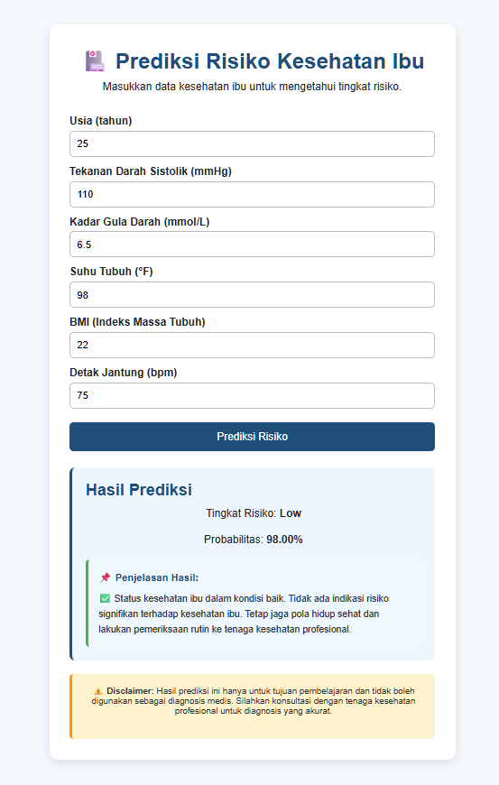

# Maternal Health Risk Prediction Web API

Aplikasi untuk memprediksi **risiko kesehatan ibu** menggunakan model **Machine Learning Random Forest** yang diintegrasikan dengan **REST API Flask** dan aplikasi web berbasis **HTML, CSS, dan JavaScript**.

**Mata Kuliah**: Pemrograman Berbasis Platform  
**Model**: Random Forest (dilatih di Google Colab)  
            https://colab.research.google.com/drive111wkTjBTXhOQvA9pYp9Vi0rflfTdJJ-8?usp=sharing

**Dataset**: Maternal Health Risk Dataset

---

## Deskripsi Project

Project ini mengintegrasikan **Machine Learning**, **REST API Flask**, dan **Web Interface** untuk prediksi risiko kesehatan ibu:

- **Model ML**: Dilatih di Google Colab dan disimpan dalam format `.pkl`
- **Backend API**: Flask REST API untuk memproses prediksi
- **Frontend**: Web interface HTML/CSS/JavaScript untuk input data dan tampil hasil

**Alur Data**: Input User (7 fitur kesehatan) → API Flask → ML Model → Hasil Prediksi (Risiko Level)

---

## Alur Sistem

```text
Google Colab
↓
Training Model Random Forest
↓
Export Model ke file .pkl
↓
REST API Flask membaca model
↓
Web HTML CSS JavaScript mengirim input ke API
↓
API mengembalikan hasil prediksi
↓
Web menampilkan hasil prediksi risiko kesehatan ibu
```

---

## Struktur Folder Project

```text
Breast_Cancer_web_api/
│
├── api/
│   ├── app.py
│   └── requirements.txt
│
├── model/
│   ├── maternal_model.pkl
│   ├── label_encoder.pkl
│   └── feature_columns.pkl
│
├── web/
│   ├── index.html
│   ├── style.css
│   └── script.js
│
├── .gitignore
└── README.md
```

---

## Deskripsi File & Folder

| File/Folder | Keterangan |
|---|---|
| `api/app.py` | Flask REST API utama |
| `api/requirements.txt` | Dependencies Python |
| `model/maternal_model.pkl` | Model Random Forest hasil training |
| `model/label_encoder.pkl` | Encoder untuk mengubah output numerik ke label risiko |
| `model/feature_columns.pkl` | Daftar fitur input yang digunakan model |
| `web/index.html` | Form input data kesehatan ibu |
| `web/style.css` | Styling web interface |
| `web/script.js` | Koneksi web ke API |
| `.gitignore` | File untuk mengabaikan file tertentu di GitHub |
| `README.md` | Dokumentasi project |

---

## Dataset: Maternal Health Risk

**Sumber**: Maternal Health Risk Dataset

### Karakteristik Dataset:
- **Total Sampel**: Ratusan data ibu hamil
- **Target**: Risiko kesehatan (Low Risk, Medium Risk, High Risk)
- **Fitur Input**: 7 variabel kesehatan

### 7 Fitur Input:

| # | Fitur | Keterangan |
|---|---|---|
| 1 | Age | Usia ibu (tahun) |
| 2 | Systolic_BP | Tekanan darah sistolik (mmHg) |
| 3 | Diastolic_BP | Tekanan darah diastolik (mmHg) |
| 4 | Blood_Sugar | Kadar gula darah (mmol/L) |
| 5 | Body_Temp | Suhu tubuh (°F) |
| 6 | BMI | Indeks Massa Tubuh |
| 7 | Heart_Rate | Detak jantung (bpm) |

---

## Objektif Project

1. Memahami dataset risiko kesehatan ibu
2. Membangun classification model menggunakan Random Forest
3. Evaluasi model dan hyperparameter tuning
4. Mengintegrasikan model ke REST API
5. Membuat web interface untuk prediksi interaktif

